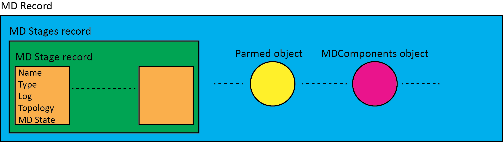

#############
MD DataRecord
#############

MD DataRecord a brief overview
==============================

Molecular Dynamics (MD) simulations are notoriously time consuming and
computational demanding. In terms of data, a lot of information
need to be stored and retrieved such as atomic coordinates, atomic velocities,
forces and energies just to cite only few; extracting and managing this data then
becomes crucial. The MD DataRecord API simplifies the access to the md data in
the MD floe programming for Orion.
In the OpenEye Datarecord model, data is exchanged between cubes in format of
data records where POD data, custom objects, json data etc.  are stored
and retrieved by using the associated field names and types. The MD Datarecord API
is built on the top of the OpenEye Datarecord, standardizing the record content
data produced during MD runs in a well-structured format and providing
an API point to its access.

MD DataRecord structure
-----------------------
The MD data produced along MD runs is structured in what is named the *md record*:

    * the md record contains a sub-record named *md stages* where md information is saved. This sub-record is
      a list of *md stage* records;

    * each *md stage* is a record itself with an associated name, type, log data, topology and MD State info.
      The latter is a custom object that stores data useful to restart MD runs such as, atomic positions,
      velocities and box information;

    * the md record at the top level contains a Parmed object used to carry the whole system parametrization data

    * the md record at the top level can also contain other data such as the MDComponents object used to carry info
      related to the different md system parts such as ligand, protein, solvent, cofactors etc. or can contains the
      starting ligand and protein with their names, unique identifiers such as the flask id , cofactor ids etc.

The following picture shows the *md record* structure and its main components

.. figure_MDRecord:

   **Structure of the MD Record**

The *md record* is user accessible by using the *MDDataRecord*  API. In order to use it, the `MDOrion <https://github.com/oess/openmm_orion>`_
package must be installed. The installation of the package also requires to have access to the OpenEye Magpie repository
for some dependencies. The API has been designed to transparently work locally and in Orion.
To use the API the user needs to create a *MDDatarecord* object starting from an *OERecord* object, after that
getter and setter functions can be used to access the md data (see full `MDDatatecord API Documentation`_).

Code snippets
-------------------

The following code snippets give an idea on how to use the API.

.. warning::

    In the following examples **record** is an *OpenEye Datarecord* produced
    running MD floes such as *Solvate and Run MD* or *Solvate and Run Protein-Ligand MD*.
    Starting from the MDOrion pkg v2.0.0, the datasets produced from the *Short Trajectory MD
    with analysis* floe is "ligand centric" and the MDDatarecord API cannot be directly applied
    to the produced records. However, the API still works on the conformer (poses) ligand sub-records
    which are still *md records*

.. code:: python

    from MDOrion.Standards.mdrecord import MDDataRecord

    # To use the MD Datarecord API an MDDataRecord instance is built starting from an OERecord
    md_record = MDDataRecord(record)

    # At this point getters and setters can be used to
    # extract/set info from/to the md record

    # MD Stage names available
    stage_names = md_record.get_stages_names

    # Get a MD Record Stage
    md_stage_production = md_record.get_stage_by_name(stage_names[2])

    # Extract the logging info from a stage
    info_stage = md_record.get_stage_info(stg_name=stage_names[2])

    # Extract the MD State from a stage
    md_set_up_state = md_record.get_stage_state(stg_name=stage_names[0])

    # Extract the Parmed Structure from the md record and synchronize the
    # positions, velocities and box data to the selected stage state
    pmd_structure = md_record.get_parmed(sync_stage_name=stage_names[2])

    # Extract the OEMol system flask from the record and its title
    flask = md_record.get_flask
    flask_title = md_record.get_title

    # Extract the trajectory file name associated with a stage. In this
    # case the stage trajectory in unpacked and the trajectory name
    # can be used in any md analysis pkg to be loaded
    trj_name = md_record.get_stage_trajectory(stg_name=stage_names[2])

    # Add a new Stage to the md_stages record
    md_record.add_new_stage(stage_name="New_Stage",
                            stage_type="NPT",
                            topology=flask,
                            mdstate=md_set_up_state,
                            data_fn="test.tar.gz")

MDDatatecord API Documentation
==============================

Follow the API documentation

.. automodule:: orionmdcore.mdrecord.mdrecord
   :members:
